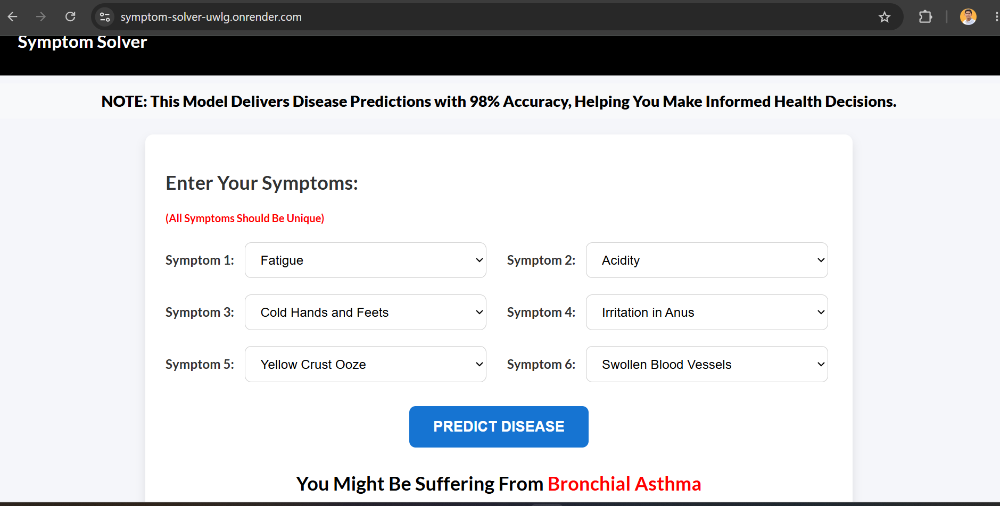
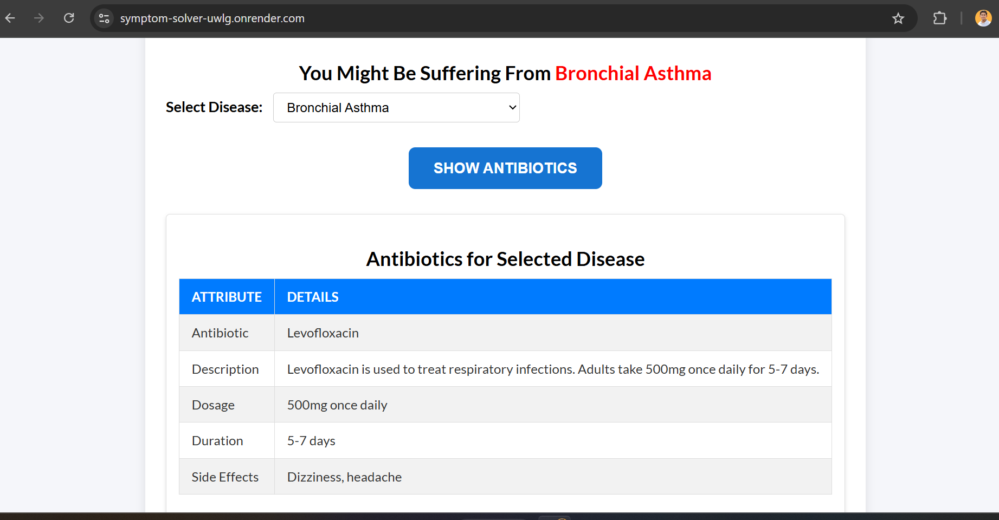
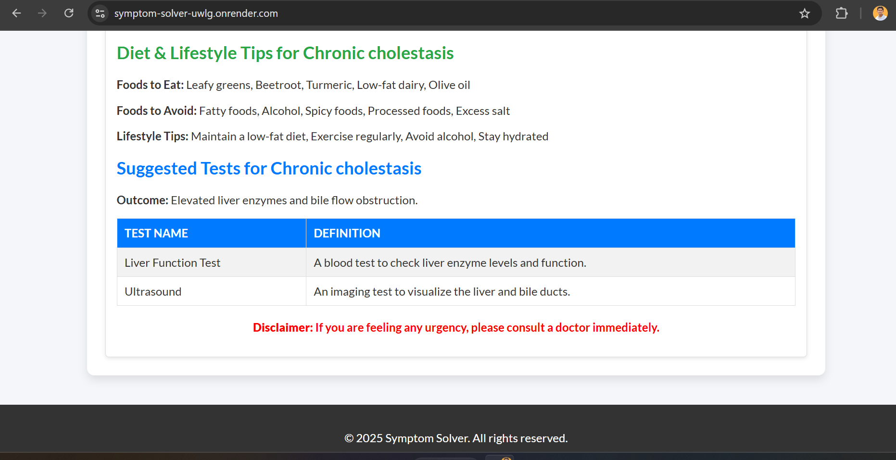

# Symptom Solver - Machine Learning-Based Disease Prediction & Healthcare Recommendation Web Application

Symptom Solver is a Machine Learning-powered healthcare web application that predicts potential diseases based on user-selected symptoms. The platform provides disease predictions along with recommended medical tests, antibiotic information, and diet & lifestyle suggestions to support informed healthcare decisions.

## Features

- Disease prediction using Machine Learning
- Symptom-based diagnosis support
- Medical test recommendations
- Antibiotic information for predicted diseases
- Diet and lifestyle recommendations
- Fuzzy symptom matching for improved input accuracy
- Responsive and user-friendly interface
- Deployed web application

## Tech Stack

### Backend
- Flask
- Python
- Scikit-learn
- Pandas
- NumPy

### Frontend
- HTML5
- CSS3
- JavaScript

### Machine Learning
- Decision Tree Classifier
- FuzzyWuzzy (Symptom Matching)

## How It Works

1. User selects symptoms from the dashboard.
2. Symptoms are encoded using predefined mappings.
3. Fuzzy matching handles minor input variations.
4. The trained Decision Tree model predicts the most likely disease.
5. The system displays:
   - Predicted Disease
   - Recommended Medical Tests
   - Antibiotic Information
   - Diet Recommendations
   - Lifestyle Suggestions

## Installation

### Clone Repository

```bash
git clone <repository-url>
cd Symptom-Solver
```

### Create Virtual Environment

```bash
python -m venv venv
```

### Activate Environment

#### Windows

```bash
venv\Scripts\activate
```

#### Linux/Mac

```bash
source venv/bin/activate
```

### Install Dependencies

```bash
pip install -r requirements.txt
```

### Run Application

```bash
python app.py
```

Application will run on:

```text
http://127.0.0.1:5000
```

## Deployment

The application is deployed on Render.

```text
https://symptom-solver-uwlg.onrender.com
```

## Results








## Disclaimer

This application is intended for educational and informational purposes only. It does not replace professional medical advice, diagnosis, or treatment. Users should consult qualified healthcare professionals for medical concerns.

## Author

**Harsh Katariya**

Bachelor of Engineering (Information Technology)

Machine Learning | Data Analytics | Artificial Intelligence
